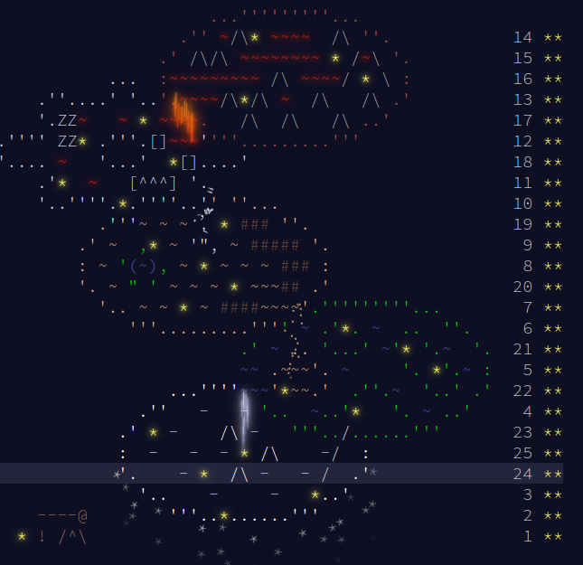

# Advent of code 2023

**Finished!!**

My solution for the AOC 2023 puzzles. This year I have decide to implement my
solutions in C++ using the 23 standard so I can get familiarized with the string
processing and modern range-based utilities.

## Conclusions

After solving all the problems in C++23 I want to summarize the main conclusions
about the current state of this standard:
- Overall, it seems an incomplete product
- I wasn't able to use modules. There isn't much documentation or examples using
  them.
- Ranges has lights and shadows. Of course they are a huge addition to the
  lenguaje but when you try to use them in a way iterators are used in rust for
  instance, you can easily fall into situations where you need tools that are
  ton available. For example, collecting results in new containers.
- C++23 tries to provide some of this missing tools but the support from main
  compilers is very inconsistent. You have to change the compiler of the
  implementation of the standard library to get a certain feature.

## Day 1

Input: each line is a string with at least 2 digits.

- Part 1: For each line create a number with the first and last digit and sum
  the numbers for all the lines.
- Part 2: The numbers in the lines might be spelled.

## Day 2

Input: A list of games were balls of three colors were picked from a bag.

- Part 1: Sum the ids of the games that are possible with a given maximum value
  of balls of each color.
- Part 2: Find the sum of the products of the minimum balls required by each
  game to be possible.

## Day 3

Input: An array of numbers, symbols and dots.

- Part 1: Sum all the numbers next to a symbol.
- Part 2: Sum the product of pairs of numbers that are connected through a "*".

## Day 4

Input: Cards with lottery winning numbers and the list of numbers you play.

- Part 1: Sum the points given by all the cards.
- Part 2: New rule to force picking card copies. Find the total number of cards
  you end up with.

## Day 5

Input: A list of seeds and dictionaries to convert seeds into other categories.

- Part 1: Find the lowest location (last kind of the conversion chain).
- Part 2: The list of seeds were pairs of values and range (more seed ids to
  evaluate).

## Day 6

Input: Pairs of values for times and distance.

- Part 1: Calculate the games you can play to beat the record of the given
  distance in the given time.
- Part 2: The vales were only a single long value.

## Day 7

Input: Hands of cards with an associated number.

- Part 1: Sort the hands with some rules.
- Part 2: Rules modification to allow Jokers.

## Day 8

Input: First line is a series of left and right instructions, the rest are the
instructions to build a double linked list.

- Part 1: Number of instructions to run until the end of the list is reached
  (ZZZ)
- Part 2: Number of instructions to run until all the posible starts (end with
  A) reach the and at the same time (node ending in Z).

## Day 9

Input: Sequence of numbers in each line. Calculate a Pascal triangle
subtracting.

- Part 1: Estimate the next value of each series and add all.
- Part 2: Estimate the previous value of each series and add all.

## Day 10

Input: An array with connected pipes.

- Part 1: Distance to the furthest point.
- Part 2: Area enclosed.

## Day 11

Input: Array with sparse galaxies

- Part 1: Find the sum of shortest distance between pairs adding a row and col
  in places without galaxies.
- Part 2: The same but replacing empty rows/cols with a million empty rows and
  cols.

## Day 12

Input: Each line is a combination of characters indicating working or break
pieces. The ? means unknown. At the end of the line there is a sequence of known
contiguous working pieces.

- Part 1: How many compatible configurations are in total.
- Part 2: Concatenate 5 times the input sequence and recalculate.

## Day 13

Input: Blocks of arrays with # or .

- Part 1: Find the columns or rows that mirrors the array.
- Part 2: Find the pixel that is wrong so the mirror lines change.

## Day 14

Input: A maze with round rocks and walls

- Part 1: Tilt the maze to the north and calculate the total charge.
- Part 2: Apply 1000000000 tilt cycles and calculate the total charge.

## Day 15

Input: A sequence of commands

- Part 1: Implement a hashing algorithm.
- Part 2: Put lenses in boxes using the hashing algorithm.

## Day 16

Input: Light bouncing in a set of mirrors and splitters.

- Part 1: Find how many tiles are illuminated when light enters from 0,0 to
  right.
- Part 2: Find the entering position to maximize illuminated tiles.

## Day 17

Input: Path finding.

- Part 1: At most 3 straight moves
- Part 2: At least 4 straight moves and at most 10 before turning.

## Day 18

Input: List of indications to dig a trench

- Part 1: Find the volume of the removed terrain with small numbers
- Part 2: Parse the hex codes to calculate with larger numbers

## Day 19

Input: Each line of the input is a pipeline processing an input.

- Part 1: Count success and rejected
- Part 2: Calculate all combinations

## Day 20

Input: Signal processing. Each line tells how each node modifies an input
signal. Nodes are connected forming trees.

- Part 1: Count low and high pulses after one button press
- Part 2: Minimum number press to deliver a low pulse. Trick, look at how the
  nodes are connected and realize there are 4 sub-trees.

## Day 21

Input: A maze with rocks and garden. Simulate propagation across the maze

- Part 1: How many occupied after 64 steps
- Part 2: How many after a huge number of steps? Trick: the number is a multiple
  of the maze size. Moreover the maze has a simmetry.

## Day 22

Input: Like a tetris in 3d

- Part 1: Calculate how many pieces can be removed without collapsing other
  pieces
- Part 2: Calculate the chain reaction for each pieces

## Day 23

Input: Longest path finding

- Part 1: Follow arrows
- Part 2: Arrows are normal tiles

## Day 24

Input: Particle trajectories

- Part 1: How many overlap in xy projection inside a given square. Problem, the
  numbers are very large and cause overflow. Trick: Use float128 form c++23
- Part 2: Calculate the trajectory that impacts all the others. Trick, solve the
  sistem of equations. Problem, it is not a linear system and to find the
  solution there are overflows. Solution: Solve the system symbolically with sympy
  and evaluate.

## Day 25

Input: A graph

- Part 1: What 3 edges we need to remove to get 2 clusters. Find the sizes of
  the resulting subgraphs. Solution: Apply the Stoer–Wagner minimum cut
  algorithm

